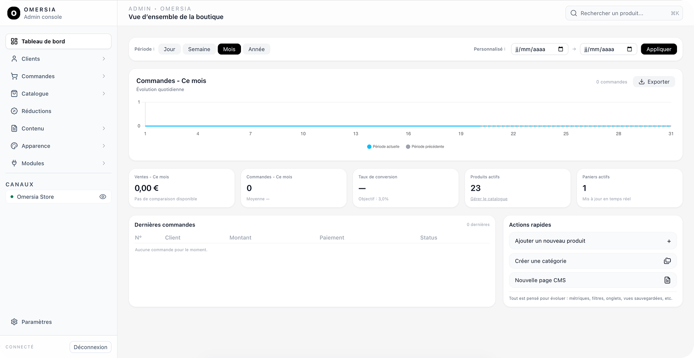

# Omersia

[](LICENSE)
[](https://laravel.com)
[](https://nextjs.org)
[](https://php.net)
[](https://typescriptlang.org)
[](CONTRIBUTING.md)

> 🛒 Plateforme e-commerce moderne et modulaire construite avec **Laravel** et **Next.js**



---

## ✨ Fonctionnalités

- 🎨 **Page Builder** – Constructeur de pages drag-and-drop avec 28+ widgets
- 🛍️ **Catalogue Produits** – Gestion complète des produits, variantes et catégories
- 🎭 **Thèmes personnalisables** – Système de thèmes avec 22 variables CSS
- 💳 **Paiements Stripe** – Intégration complète Stripe avec webhooks
- 🔍 **Recherche rapide** – Recherche instantanée avec MeiliSearch
- 📱 **Responsive** – Interface mobile-first avec Tailwind CSS
- 🌍 **Multi-langues** – Support i18n avec traductions
- 📦 **Architecture modulaire** – 10 packages Laravel indépendants

---

## 🚀 Démarrage rapide

### Prérequis

- PHP 8.4+
- Node.js 20+
- Composer 2.x
- Docker & Docker Compose

---

## 🐳 Installation (une seule commande)

```bash
# Cloner le repository
git clone https://github.com/votre-username/omersia.git
cd omersia

# Installation complète
make install
```

Le script d'installation va :
1. Vérifier les prérequis (PHP, Node, Docker, etc.)
2. Créer les fichiers `.env` (backend + frontend)
3. Installer les dépendances (Composer + npm)
4. Démarrer Docker (MySQL, Meilisearch, Mailpit)
5. Exécuter les migrations et seeders
6. Créer un utilisateur admin (email/password)
7. Générer et synchroniser la clé API

Une fois terminé, lancez :

```bash
make dev
```

L'application sera disponible sur :

| Service | URL |
|---------|-----|
| Storefront | http://localhost:8000 |
| Admin Panel | http://localhost:8000/admin |
| API | http://localhost:8000/api/v1 |
| Mailpit | http://localhost:8025 |

---

## 🧰 Commandes disponibles

```bash
make install      # Installation complète
make dev          # Démarrer l'environnement
make test         # Lancer les tests
make lint         # Vérifier le code
make lint-fix     # Corriger le code
make clean        # Nettoyer les caches
make build        # Build production
```

### Commandes avancées

```bash
make setup-env    # Créer les fichiers .env uniquement
make setup-db     # Migrations + seeders
make apikey       # Générer une nouvelle clé API
make admin        # Créer un nouvel admin
```

---

## 🔧 Installation CI/CD (non-interactive)

```bash
INTERACTIVE=false \
ADMIN_EMAIL=admin@example.com \
DEMO_DATA=false \
make install
```

Le mot de passe admin sera généré automatiquement et affiché à la fin.

---

## 📚 Documentation

| Document                 | Description                                  |
|--------------------------|----------------------------------------------|
| Guide d'installation     | Installation complète pour le développement |
| Déploiement Production   | Guide de mise en production                  |
| Architecture Backend     | Structure des packages Laravel              |
| Page Builder             | Guide du constructeur de pages              |
| Personnalisation Thèmes  | Personnaliser l'apparence                   |
| Configuration Docker     | Configuration Docker                        |
| Index Complet            | Toute la documentation                      |

---

## 🏗️ Architecture

```text
omersia/
├── backend/                 # Laravel 10 API
│   ├── packages/            # Packages modulaires
│   │   ├── Admin/           # Interface d'administration
│   │   ├── Catalog/         # Produits, commandes, panier
│   │   ├── Customer/        # Gestion clients
│   │   ├── Payment/         # Paiements Stripe
│   │   ├── Appearance/      # Thèmes et personnalisation
│   │   └── ...
│   └── app/                 # Application principale
├── storefront/              # Next.js 16 Frontend
│   ├── src/
│   │   ├── app/             # App Router
│   │   ├── components/      # Composants React
│   │   └── lib/             # Utilitaires et API
│   └── public/
└── docs/                    # Documentation
```

---

## 🛠️ Stack technique

### Backend

- Framework : Laravel 12
- PHP : 8.4+
- Base de données : MySQL 8.0
- Recherche : MeiliSearch
- Paiements : Stripe
- Auth : Laravel Sanctum

### Frontend

- Framework : Next.js 16 (App Router)
- React : 19
- CSS : Tailwind CSS 4
- TypeScript : 5.x

### Infrastructure

- Reverse proxy : Nginx
- Conteneurs : Docker & Docker Compose
- CI/CD : GitHub Actions

---

## 🤝 Contribuer

Les contributions sont les bienvenues !

1. Fork le projet
2. Créer une branche :
   ```bash
   git checkout -b feature/amazing-feature
   ```
3. Commit vos changements :
   ```bash
   git commit -m "feat: add amazing feature"
   ```
4. Push sur la branche :
   ```bash
   git push origin feature/amazing-feature
   ```
5. Ouvrir une Pull Request

---

## 📋 Roadmap

Voir `ROADMAP_V1.md` pour les fonctionnalités planifiées.

### Prochaines fonctionnalités

- Multi-devises
- Multi-boutiques avancé
- Intégration PayPal
- Application mobile
- Système de plugins

---

## 🔒 Sécurité

Pour signaler une vulnérabilité, consultez notre Politique de Sécurité.

---

## 📄 Licence

Ce projet est sous licence MIT.  
Voir le fichier `LICENSE` pour plus de détails.

---

## 💬 Support

- 📖 Documentation
- 🐛 Signaler un bug
- 💡 Proposer une fonctionnalité
- 💬 Discussions

---

<p align="center">Made with ❤️ by the <strong>Omersia Team</strong></p>
